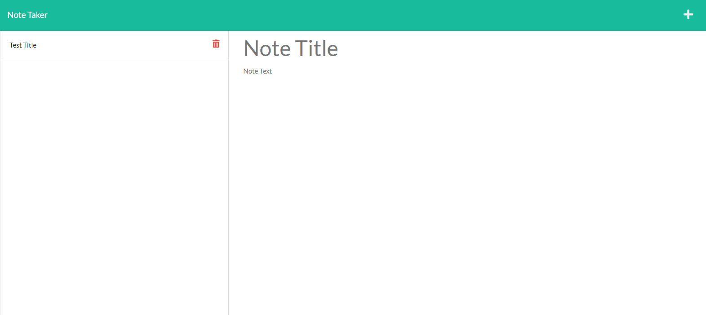

# Note Taker 3000

## Purpose of this challenge

The purpose of this challenge was to get more famaliar with using express, routing, and heroku. I learned in this challenge that it is easier to break up the app into smaller functioning parts that can all work together. Also working with and deploying the application using heroku showed me how the two are connected.

## Image of webpage
 

## App link 

https://note-taker-3030.herokuapp.com/